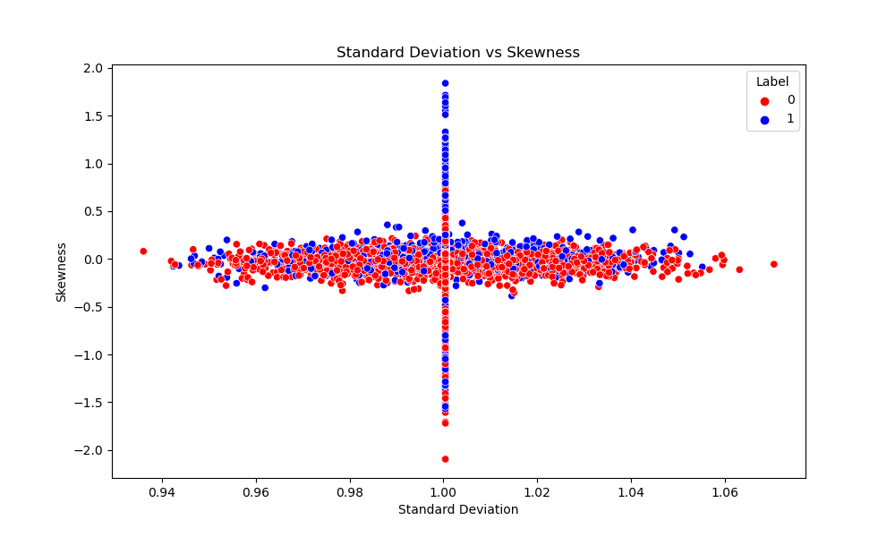
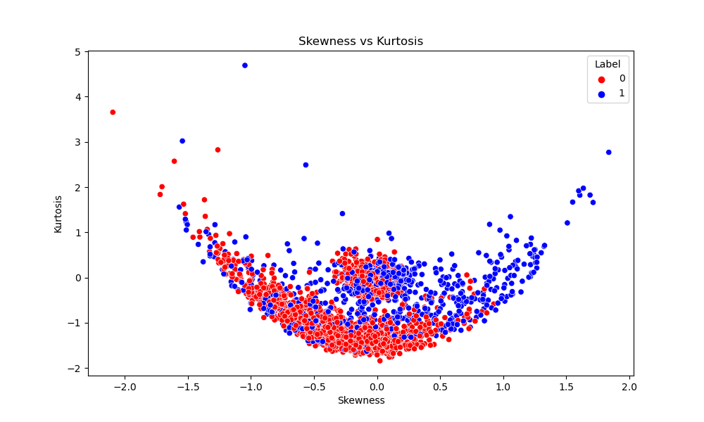
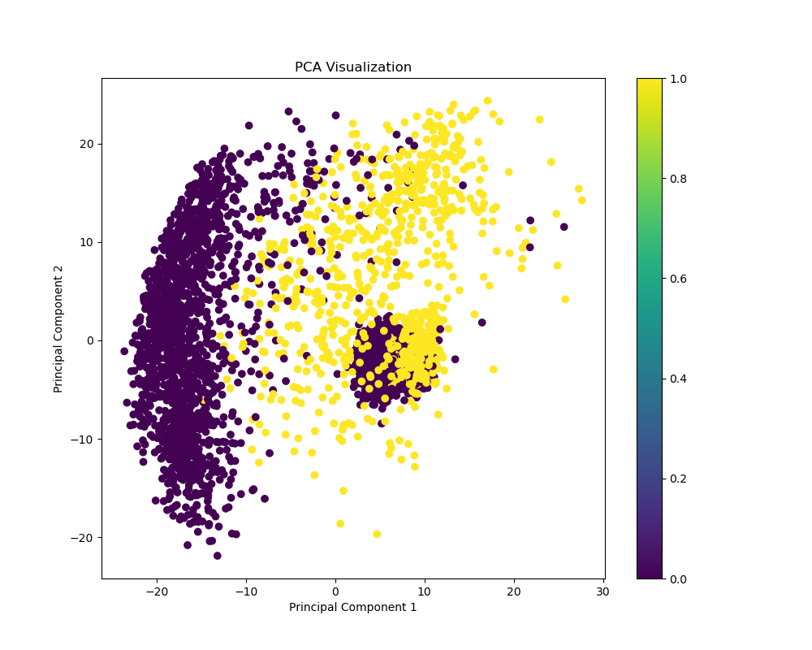
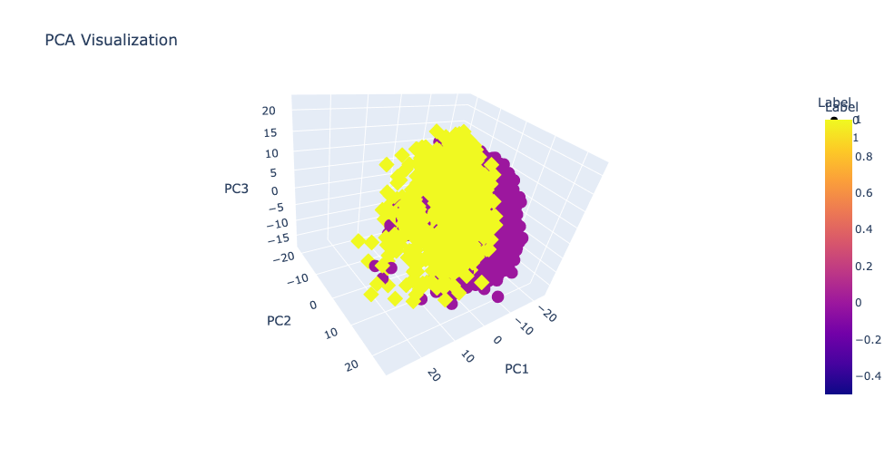
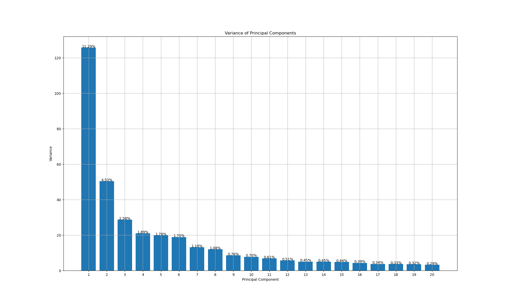

# GenerativeAI

**Generative AI Challenge: Distinguishing Real and Fake Profile Photos**

This GitHub repository focuses on the development of a machine learning model to combat identity fraud in the digital realm. As a participant in the global competition, I have successfully completed the project and would like to share insights into my approach.

The objective of the competition was to create a model capable of accurately distinguishing between real and fake profile photos generated using advanced AI algorithms. With the prevalence of generative AI, fraudulent identities have become a significant concern for online services.

To tackle this challenge, I employed various machine learning techniques and methodologies. Initially, I analyzed the provided dataset, which consisted of a `train.csv` file for training the model and a `test.csv` file for evaluation. The target variable in the training dataset indicated whether a photo was 'real' or 'fake' (labeled as '0' and '1' respectively).

Preprocessing played a crucial role in preparing the image data for model training. As the images were represented as 20 x 20 x 3 (channels), I performed necessary transformations to normalize the pixel values and ensure consistency across the dataset.

Next, I explored different machine learning algorithms, including but not limited to convolutional neural networks (CNNs), decision trees, and ensemble methods. I trained and fine-tuned multiple models, iterating through various hyperparameters to optimize performance.

To evaluate the models, I leveraged the `test.csv` file, making predictions on unseen data. The F1 score was employed as the evaluation metric, providing insights into the model's precision and recall.

Upon achieving satisfactory results, I focused on documenting my methodology, including detailed explanations of the chosen algorithms, preprocessing techniques, and hyperparameter tuning strategies. I also highlighted the challenges faced during the project and the techniques employed to overcome them.

In this repository, you will find the complete codebase, including the necessary scripts for data preprocessing, model training, and evaluation. Additionally, I have provided a comprehensive README file with instructions on how to reproduce the results and deploy the trained model.

By sharing my approach and codebase, I aim to contribute to the broader machine learning community and foster discussions on effective techniques for combating identity fraud in online services.

Feel free to explore the repository and utilize the resources to enhance your understanding of this critical issue. Together, we can create more secure and trustworthy online experiences for users worldwide.

## Project Overview

This GitHub repository addresses the critical issue of identity fraud in the digital realm. As a participant in the global competition, I have successfully completed the project and would like to share insights into my approach.

## Importing Libraries

```python
import pandas as pd
import numpy as np
import matplotlib.pyplot as plt
from sklearn.decomposition import PCA
import plotly.express as px
from tqdm import tqdm
import seaborn as sns
from sklearn.svm import SVC
```

```python
import torch
import torch.nn as nn
import torch.optim as optim
from torchvision import models
from torch.utils.data import TensorDataset, DataLoader
from torchvision.models import vgg19
from sklearn.model_selection import train_test_split
from sklearn.preprocessing import StandardScaler
import xgboost as xgb
from PIL import Image
from torchvision import transforms as T
from sklearn.neighbors import KNeighborsClassifier
from sklearn.model_selection import GridSearchCV
from sklearn.metrics import accuracy_score
```

```python
import sys
from tqdm import tqdm
import time
import copy
```

## Reading the datasets

```python
# Load the CSV file
data = pd.read_csv('train.csv')
test_data = pd.read_csv('test.csv')
```

```python
# Separate the labels and features
labels = data.iloc[:, 0]
features = data.iloc[:, 1:]
```


## Data Visualization


Calculating standard deviation, kurtosis, and skewness for each instance's 1200 features provides valuable insights into the data's variability, distribution shape, and asymmetry. This analysis helps identify patterns, outliers, and unique characteristics, guiding data preprocessing and modeling decisions for improved identity verification accuracy.

```python
# Calculate standard deviation, skewness, and kurtosis for each feature
std_dev = features.std(axis=1)
skewness = features.skew(axis=1)
kurtosis = features.kurtosis(axis=1)
```

```python
# Create a new DataFrame with labels and statistical metrics
df_stats = pd.DataFrame({'Label': labels, 'Standard Deviation': std_dev, 'Skewness': skewness, 'Kurtosis': kurtosis})

# Set the colors for different label values
label_colors = {0: 'red', 1: 'blue'}
```

```python
# Plot the graphs
plt.figure(figsize=(10, 6))
sns.scatterplot(data=df_stats, x='Standard Deviation', y='Skewness', hue='Label', palette=label_colors)
plt.title('Standard Deviation vs Skewness')
plt.xlabel('Standard Deviation')
plt.ylabel('Skewness')
plt.savefig('stdVsSkew.png')
plt.show()
```



```python
plt.figure(figsize=(10, 6))
sns.scatterplot(data=df_stats, x='Standard Deviation', y='Kurtosis', hue='Label', palette=label_colors)
plt.title('Standard Deviation vs Kurtosis')
plt.xlabel('Standard Deviation')
plt.ylabel('Kurtosis')
plt.savefig('stdVsKur.png')
plt.show()
```


```python
plt.figure(figsize=(10, 6))
sns.scatterplot(data=df_stats, x='Skewness', y='Kurtosis', hue='Label', palette=label_colors)
plt.title('Skewness vs Kurtosis')
plt.xlabel('Skewness')
plt.ylabel('Kurtosis')
plt.savefig('skewVsKur.png')
plt.show()
```



## Principal Component Analysis (PCA)

To gain insights into the dataset and understand the potential for image classification, I performed Principal Component Analysis (PCA). Initially, I reduced the dimensionality of the image data to two principal components (n=2) and visualized it in a 2D plot. Subsequently, I expanded the analysis to three principal components (n=3) and plotted the results in a 3D plot.

#### 2D Visualization

The 2D plot using the first two principal components provided a preliminary understanding of the data's separability. However, it revealed limited discriminative patterns between real and fake profile photos.



#### 3D Visualization

By considering the third principal component, the 3D plot offered additional insights into the dataset's structure. Although some separation between real and fake profiles was observed, it remained insufficient for reliable image classification.



### Scree Plots

To assess the variance contained within the principal components, I generated scree plots. These plots demonstrated the diminishing amount of explained variance as we considered additional principal components. The analysis revealed that the initial 10 principal components contained insufficient information for effective image classification.



## Next Steps

Based on the limitations of PCA analysis, I recognized the need to explore alternative feature extraction techniques or consider more advanced models. Further investigations will focus on methods such as deep learning architectures, feature engineering, or leveraging pre-trained models to enhance classification performance.

Stay tuned for updates as I delve deeper into the project, explore new approaches, and work towards improving the accuracy of the identity verification model.

## Train-Val split 

```python
# Convert the features to a NumPy array
X = features.to_numpy()

# Convert the labels to a NumPy array
y = labels.to_numpy()

# Perform a stratified train-test split
X_train, X_test, y_train, y_test = train_test_split(X, y, test_size=0.15, stratify=y, random_state=42)
```

## Support Vector Classifier

```python3
# Train an SVM radial model
svm_model = SVC(kernel='rbf')
svm_model.fit(X, y)

# Evaluate the model on the test set
accuracy = svm_model.score(X_test, y_test)
print(f"Accuracy: {accuracy}")
```


I experimented with the Support Vector Classifier (SVC) for identity verification. It showed high accuracy on the training and validation sets but didn't perform as well on the test set provided by the bitgrit platform. SVC is a popular classification algorithm known for handling complex decision boundaries. I'll explore other approaches, like ensemble methods or fine-tuning SVC hyperparameters, to improve model performance and enhance the accuracy of the identity verification system.

## ResNext101 CNN Model

For the classification task, I utilized a ResNeXt101 CNN model and trained it on the dataset. To prepare the data, I reshaped the instances from a 1200 shape to a 20x20x3 format, suitable for input into the CNN architecture.

During training, the model exhibited good validation accuracy, indicating its ability to learn meaningful patterns and features from the data. However, when evaluated on the test set, the model's performance yielded an accuracy of around 65 percent.

## KNN Classifier

```python
from sklearn.neighbors import KNeighborsClassifier

# Define the parameter grid to search over
param_grid = {
    'n_neighbors': [3, 5, 7, 9, 11],  # Different values for the number of neighbors
    'weights': ['uniform', 'distance'],  # Different weight options
    'algorithm': ['auto', 'ball_tree', 'kd_tree', 'brute'],  # Different algorithm options
    'leaf_size': [10, 20, 30],  # Different leaf size options
}

# Create a kNN classifier object
knn_model = KNeighborsClassifier()

# Perform grid search with cross-validation
grid_search = GridSearchCV(knn_model, param_grid, cv=5)  # Adjust cv parameter for desired number of cross-validation folds
grid_search.fit(X_train, y_train)

# Get the best classifier from the grid search
best_knn_model = grid_search.best_estimator_

# Make predictions on the test set using the best classifier
test_predictions = best_knn_model.predict(X_test)

# Calculate accuracy on the test set
accuracy = accuracy_score(y_test, test_predictions)
print(f"Accuracy: {accuracy}")

```

Finally, I employed the K-Nearest Neighbors (KNN) classifier for the identity verification task. The KNN algorithm is a non-parametric, instance-based learning method that makes predictions based on the majority vote of its nearest neighbors.

Remarkably, the KNN classifier exhibited good accuracy on both the validation and test sets, indicating its effectiveness in capturing the underlying patterns within the data. This performance can be attributed to the nature of the KNN algorithm, which does not make any assumptions about the underlying data distribution or model structure. Instead, it relies on the proximity of instances in the feature space to make predictions.

By considering the nearest neighbors, the KNN classifier can effectively capture the local structure of the data, making it robust to variations and complex decision boundaries. This attribute makes the KNN classifier suitable for the identity verification task, as it can discern patterns within the data without assuming any specific functional form.

The success of the KNN classifier in achieving good accuracy on both the validation and test sets indicates its ability to generalize well and make accurate predictions on unseen data. This makes it a promising choice for the identity verification system, providing reliable results and bolstering the integrity of online transactions.

Moving forward, further refinements to the KNN classifier, such as optimizing the value of K or exploring distance metrics, may be explored to enhance its performance and ensure its suitability for real-world applications.


## Additional 

Additionally, I experimented with training a Vision Transformer, specifically the DeiT (Data-efficient image Transformers) model, for the identity verification task. In this approach, the images were resized to a 20x20x3 format to match the input requirements of the Vision Transformer. Despite the potential of Vision Transformers in capturing global dependencies and patterns in images, the results obtained were not satisfactory in terms of accuracy.

Furthermore, I implemented a Deep Feedforward Neural Network (FFNN) with an input size of 1200, representing the flattened 20x20x3 image data, and an output layer size of 2 for the binary classification task. However, similar to the Vision Transformer, the FFNN model did not yield desirable results in terms of accuracy.

These outcomes indicate that the complexity and nature of the identity verification task require more sophisticated approaches than what the Vision Transformer or FFNN models could provide in their current configurations. It highlights the need to explore alternative architectures, feature engineering techniques, or model enhancements to improve the accuracy and effectiveness of the identity verification system.

Despite these initial setbacks, these experiments have provided valuable insights into the strengths and limitations of different models and approaches for the given task. These findings will guide future iterations and help in devising more effective strategies to tackle the challenges of identity verification and enhance the overall performance of the system.


